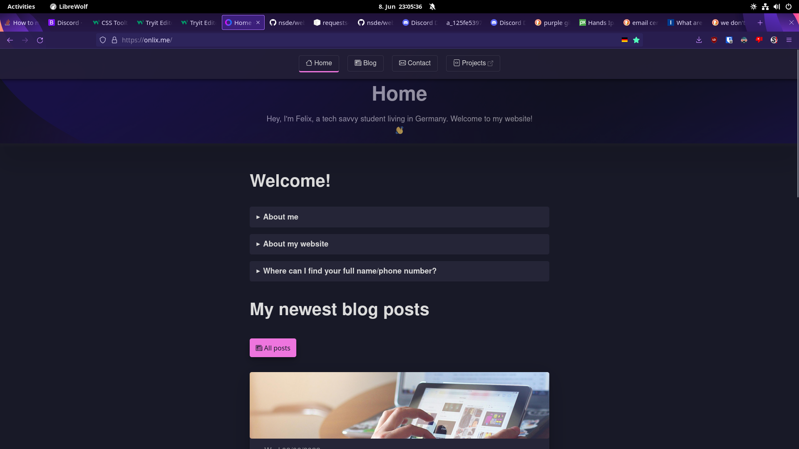

# My website » [ONLIX.ME](https://onlix.me)
The source code of my website, **onlix.me** (2021-2022).



## Self-hosting
Do you want to...
- Understand how my website works?
- Build your own project which is similar to mine?

Simply self-host my website! To be honest, easier said than done, since there might be a lot of things to set up first. I suggest deleting all unnecessary files, such as everything in...

- `/templates` (web pages) **...EXCEPT:**
    - Files starting with `_` (to keep the Jinja2 templates)
    - `home.html` (as a reference)

- `/blog` (blog posts)

- `/static` (assets/media) **...EXCEPT:**
    - `/styles` (style sheets)

- `/*.py` ***...EXCEPT:**
    - `web.py` (runner)
    - `main.py` (homepage)
    - `tools.py` (utility modules)

You also need to download/generate and accordingly copy the files listed in the `.gitignore` at the upper section

### Troubleshooting
### FileNotFoundError
Please report those issues, even if the workaround works! That way, I can safe other people time :).
Alright, a workaround is to simply create the file or directory(/-ies). Take a look at the traceback and try to figure out which (nonexistent) file in which (nonexistent) folder caused the error.

#### PIL
Problems with PIL on Linux? Choose your distribution and run the following commands.

**Debian-Based (e.g. Ubuntu/Linux Mint/PopOS)**
```sh
sudo apt install libjpeg-dev zlib1g-dev
pip install Pillow
```
**Arch Linux-Based (e.g. EndeavourOS, Manjaro)**
```sh
yay -S libjpeg zlib
pip install Pillow
```

This will ensure all needed dependencies are installed.
